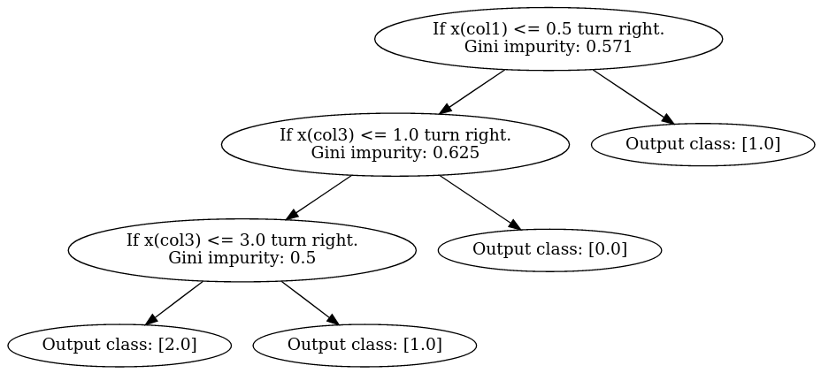

# Classification Tree
Performs multi-class classification on a dataset.

Consider a minimal dataset as example.

```python
import pandas as pd
import buildtree as bn
import graphviz as gr

c1 = [1,0,0,2,1,0,4]
c2 = [1,2,1,1,1,4,3]
c3 = [0,0,4,4,0,3,2]
c4 = [0,1,1,2,0,1,1]
d = {'col1':c1, 'col2':c2, 'col3':c3, 'col4':c4}
dataset = pd.DataFrame(d)
dataset = dataset.astype(float)
```
To build the classification tree we use the function buildTree(...) fixing some
 parameters:

- colName: name of the output column.
- featNum: number of features to be used to compute the splitting of the dataset. 
- dataDim: minimum number of instances allowed to split the dataset. If this
number is not reached, the whole dataset is used to built a tree leaf.
- tol: minumum impurity level (Gini impurity) required to split the dataset, 
otherwise the dataset produces a leaf.

Once built, the tree can be visualized using plotTree(...) importing the library
graphviz.

```python
colName = 'col4'
tree = bn.buildTree(dataset, colName, featNum=4, dataDim=1, tol=0.0)
dot = gr.Digraph()
tree.plotTree(dot)
dot
```



# Random Forest
A random forest classifier.

In the code below, the function makeForest(...) returns as output a list of 
classification trees and the out of bag error rate.
The parameter t is the number of tree to be built.

```python
import makeTest as mt

forest,err = mt.makeForest(t, dataset, colName, featNum, dataDim, tol)
```
Given a dataset,
we can split this into the training set and the
test set, setting the correct proportion in the function makeTrainSample(...).

The classification trees are than built and tested. The prediction accuracy can
be measured with the function
accuracy(...)


```python
import makeTest as mt

proportion = 0.7
xTrain,xTest = mt.makeTrainSample(dataset, proportion)

forest,err = mt.makeForest(treeNum, xTrain, colName, featNum, dataDim, tol)
acc = mt.accuracy(forest, xTest, colName)
```

# Use case - example
In this [notebook](https://github.com/SofiaTorchia/Classification-Trees-and-Random-Forests/blob/master/Project.ipynb) 
the algorithms are applied and tested on a use-case example.
Moreover, an analysis of both run time and computational complexity are carried out,
as well as a comparison with the scikit-learn implementation 
(accuracy and out of bag error rate).


